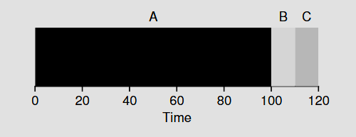
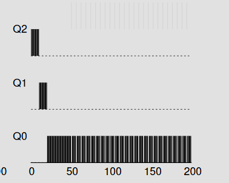
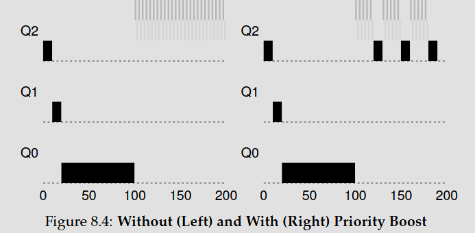
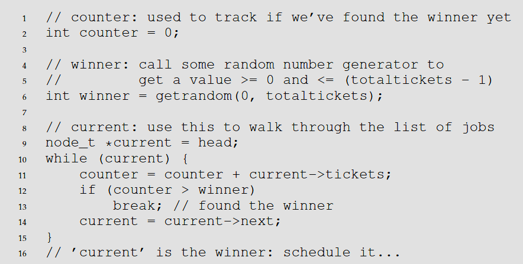
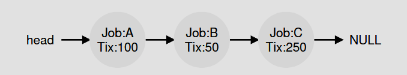
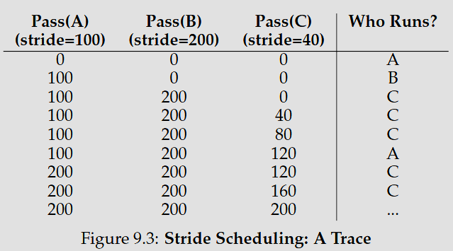

# Introduction
OS **virtualization** is making physical resources of a computer like processor, memory, etc into a virtual easy to use form of itself.

OS provides a "standard library" of methods applications can call. It is also considered a "resource manager" do to its role as managing and allocating resources.

An example of CPU **virtualization** is running multiple programs at once and having them run concurrently. Even though there is only 1 CPU due to virtualization it is able to handle everything.

Policies are used in lots of places in the OS, they essentially serve as a way for the OS to know what to do and when to handle certain scenarios.
ex, two programs are ran at once, which does the OS run first? 

```C
#include <unistd.h>
#include <stdio.h>
#include <stdlib.h>
#include "common.h"
int main(int argc, char *argv[])
  {
    int *p = malloc(sizeof(int)); // a1
    assert(p != NULL);
    printf("(%d) address pointed to by p: %p\n",
    getpid(), p); // a2
    *p = 0; // a3
    while (1) {
      Spin(1);
      *p = *p + 1;
      printf("(%d) p: %d\n", getpid(), *p); // a4
      }
  return 0;
}
```
this code block here allocates memory using `malloc()`.
Traditionally memory is an array of bytes. It accessed when programs ran for things like writting/reading from datastructures or really anything in programming.

If this code was ran twice, both programs would allocate the same memory address. This is due to the physical memory being virtualized and having different address spaces.

**Concurrency** is an issue mostly because even if you have independent threads, the order of which each program reads, updates and stores the memory its pointing to is not atomic, so it will behave weirdly. 

**Persistence** is another problem in OS. Most data needs to be stored somewhere safe and most things store things in a volatile manner.

```C
#include <stdio.h>
#include <unistd.h>
#include <assert.h>
#include <fcntl.h>
#include <sys/types.h>

int main(int argc, char *argv[]) {
  int fd = open("/tmp/file",
                O_WRONLY|O_CREAT|O_TRUNC,
                S_IRWXU);
  assert(fd > -1);
  int rc = write(fd, "hello world\n", 13);
  assert(rc == 13);
  close(fd);
return 0;
}
```

This code block creates a file in `tmp/file` that contains the string `hello world`. In order for the OS to do this it makes seperate calls such as `open()` `write()` `close()`. 

The process of actually writting involves the file system. It employs **journaling** and **copy-on-write** when writting so that if the system crashes it can be restored to a reasonable point after. 

**Isolation** is the idea that a process running on an OS does not effect another process and needed for **protection**.

# Processes
a process is simply a running program. The CPU gives the illusion of virtualization by running multiple processes with **time sharing**, or stopping a process and starting another. 

**time sharing**: allowing the resource to be used for a little while, then again by another, etc
**space sharing**: the same with memory. Dividing space among the processes wishing to use it.
**context switch**: gives the OS ability to stop running one program and start running another. 
**polices**: algorithims that make a decision within the OS. For example a **scheduling policy** will make a decision on which program to run when time sharing based off something like which program has been running the longest.

A process contains a **machine state** which tells the OS what a program can read of update while running. Part of this state is memory, since the instructions for the program are stored in memory in **registers**. It also includes a **program counter** (states which instruction of the program will execute next) and a **stack pointer** and **frame pointer**. Those are used to manage the stack for function parameters, local variables and return addresses. 
****
The OS loads any code from a program onto memory. Then a stack for runtime is allocated. The OS also may allocate memory for a heap, depending on the language the heap is used differently but in C the heap is used to request dynamically allocated data. 

when the program is loaded it is ready for execution and can be described by 3 states


the **OS scheduler** here decides how and when to schedule these processes. In this cased after process 0 was blocked it started process 1.
```c
// the registers xv6 will save and restore
// to stop and subsequently restart a process
struct context {
int eip;
int esp;
int ebx;
int ecx;
int edx;
int esi;
int edi;
int ebp;
};
// the different states a process can be in
enum proc_state { UNUSED, EMBRYO, SLEEPING,
RUNNABLE, RUNNING, ZOMBIE };
// the information xv6 tracks about each process
// including its register context and state
struct proc {
char *mem; // Start of process memory
uint sz; // Size of process memory
char *kstack; // Bottom of kernel stack
// for this process
enum proc_state state; // Process state
int pid; // Process ID
struct proc *parent; // Parent process
void *chan; // If !zero, sleeping on chan
int killed; // If !zero, has been killed
struct file *ofile[NOFILE]; // Open files
struct inode *cwd; // Current directory
struct context context; // Switch here to run process
struct trapframe *tf; // Trap frame for the
// current interrupt
};
```
An example of the data that a process will need to store. When a process stops, the registers are stored in memory and when starting up again the values are placed in the physical registers agian to start up.

**process list**: contains information about all processes in the system
**process control block**: basically a term for the data that is associated with a process.

## Process API
```c++
#include <stdio.h>
#include <stdlib.h>
#include <unistd.h>
#include <sys/wait.h>

int main(int argc, char *argv[]) {
  printf("hello (pid:%d)\n", (int) getpid());
  int rc = fork();
  if (rc < 0) { // fork failed; exit
    fprintf(stderr, "fork failed\n");exit(1);
  } else if (rc == 0) { // child (new process)
    printf("child (pid:%d)\n", (int) getpid());
  } else { // parent goes down this path
    int rc_wait = wait(NULL);
    printf("parent of %d (rc_wait:%d) (pid:%d)\n",
    rc, rc_wait, (int) getpid());
  }
  return 0;
}
```

`fork()` creates another process. It isn't an exact copy, since it has its own address space, registers, etc. The value returned by the child `fork()` is different. This is used to handle cases and write code based on what occured. 

Processes and `fork()` are non deterministic meaning that the same output is not always given. This is because the CPU scheduler decides what processes run at a given time. Theese are things to consider when writting multi threaded programs and concurrent code. 

The above code is actually deterministic, and that is because of the `wait()` call. This call waits for the child process to complete. If there was no wait, the program would not wait for the child process to finish. 

`exec()` starts running a new program overriding the current process, memory, heap, stack, etc to finish its own process. Afterwards the original process is restored as it stores the original stuff in registers.

```C
#include <stdio.h>
#include <stdlib.h>
#include <unistd.h>
#include <string.h>
#include <sys/wait.h>

int main(int argc, char *argv[]) {
  printf("hello (pid:%d)\n", (int) getpid());
  int rc = fork();
  if (rc < 0) { // fork failed; exit
    fprintf(stderr, "fork failed\n");
    exit(1);
  } else if (rc == 0) { // child (new process)
    printf("child (pid:%d)\n", (int) getpid());
    char *myargs[3];
    myargs[0] = strdup("wc"); // program: "wc"
    myargs[1] = strdup("p3.c"); // arg: input file
    myargs[2] = NULL; // mark end of array
    execvp(myargs[0], myargs); // runs word count
    printf("this shouldn’t print out");
  } else { // parent goes down this path
    int rc_wait = wait(NULL);
    printf("parent of %d (rc_wait:%d) (pid:%d)\n",
    rc, rc_wait, (int) getpid());
  }
  return 0;
}
```

In this example, `execvp()` is used to run the word counter program.

`exec()` and `fork()` are used to create processes and run programs. An example of this is the Unix shell. The shell allows typing of commands. When running a program or exe in the shell for example a subprocess is created to do this so it doesn't halt the main process and a variation of exec is ran. Depending on the exe `wait()` is called to wait until the exec is done.

`prompt> wc p3.c > newfile.txt`
 This command works by `wc pc.3` creating a subprocess with `fork()` and running the pc.3 with `exec()`. The behavior or forwarding the output of pc.3 to newfile.txt is done by closing the standard output which redirects the output to newfile.txt

 This works due to an assumption the OS makes about file descriptors. The OS looks for the first free file descriptors at zero. `STDOUT_FILENO` is the first one and gets assigned when `open()` is called so closing that file descriptor will write to the newly opened file.

 ```C
#include <stdio.h>
#include <stdlib.h>
#include <unistd.h>
#include <string.h>
#include <fcntl.h>
#include <sys/wait.h>

int main(int argc, char *argv[]) {
    int rc = fork();
    if (rc < 0) {
        // fork failed
        fprintf(stderr, "fork failed\n");
        exit(1);
    } else if (rc == 0) {
        // child: redirect standard output to a file
        close(STDOUT_FILENO);
        open("./p4.output", O_CREAT|O_WRONLY|O_TRUNC,
             S_IRWXU);
        // now exec "wc"...
        char *myargs[3];
        myargs[0] = strdup("wc"); // program: wc
        myargs[1] = strdup("p4.c"); // arg: file to count
        myargs[2] = NULL; // mark end of array
        execvp(myargs[0], myargs); // runs word count
    } else {
        // parent goes down this path (main)
        int rc_wait = wait(NULL);
    }
    return 0;
}
 ```
This code creates a child process that closes `STDOUT_FILENO` and essentially detaches it the output from the console so things like `printf()` will write to the opened file.

`kill()` is used to send **signals** to a process telling it what to do. for ex `SIGINT` is to interupt while `SIGSTP` is to stop.

Process subsystems have ways to send and recieve signals, communicate to process, and entire **process groups**

### Summary
ASIDE: KEY PROCESS API TERMS
• Each process has a name; in most systems, that name is a number
known as a process ID (PID).
• The fork() system call is used in UNIX systems to create a new pro-
cess. The creator is called the parent; the newly created process is
called the child. As sometimes occurs in real life [J16], the child
process is a nearly identical copy of the parent.
• The wait() system call allows a parent to wait for its child to com-
plete execution.
• The exec() family of system calls allows a child to break free from
its similarity to its parent and execute an entirely new program.
• A UNIX shell commonly uses fork(), wait(), and exec() to
launch user commands; the separation of fork and exec enables fea-
tures like input/output redirection, pipes, and other cool features,
all without changing anything about the programs being run.
• Process control is available in the form of signals, which can cause
jobs to stop, continue, or even terminate.
• Which processes can be controlled by a particular person is encap-
sulated in the notion of a user; the operating system allows multiple
users onto the system, and ensures users can only control their own
processes.
• A superuser can control all processes (and indeed do many other
things); this role should be assumed infrequently and with caution
for security reasons.

## Direct Execution
Control a big challenge in building an OS and we want to allow things like **time sharing** but want to ensure a process doesn't simply control the OS. Another is performance, since we need to implement virtualization in a performant way.

### Limited Direct Execution
the program is ran directly on the CPU. Creates a process entry for it, allocates memory, loads the program into memory, finds its entry point and executes.


This approach is fast since it runs everything at the hardware level, however there is a problem that arises with a resitrcted operation that wishes to be ran that the OS needs to decide how to handle such as I/O.

To handle this **user mode** and **kernel mode** are created. Essentially two different forms of processes that have rules as to what they can and cant do. 

If a program wants to do an I/O the OS executes a **trap** instruction that raises the level to **kernel mode** then executes a **return from trap** to go back to **user mode**

The OS needs to handle execution of traps properly to properly return from trap. in x86 when the OS executes a trap it pushes the kernel mode registers and other data onto a **kernel stack** that is popped to return to the proper state before the trap.

a **trap table** is created on boot to tell the hardware where certain code to exceptional events are. 


**system-call number**: number associated with a system call

when running user code the user has to specifiy the system call to execute by placing it in a register. The OS verifys the code passed as a form of **protection**

for switching there are many approaches. The issue is when a process is running the OS by definition isn't. The problem becomes how to give the OS back control.

**cooperative approach**: When a process makes a system call or is done, it executes a yield that preforms a trap back to the OS. The issue with this approach is that if an illegal or malicious process is running and doesn't preform this yield it can be stuck in a loop. 

**non cooperative approach**: if a process is hanging or mistakenly didnt yield, a timer interupt can be made that runs an interupt handler after awhile to give the OS control again. 

**context switching** is preformed by save registers of the currently executing process (onto kernel stack for example) and restore a few for the soon to be executing processes (from its kernel stack) this is done so when the return from trap is ran we return to the execution of another process. 


in this example, process A is running but interupted by time interrupt. The hardware saves its registers into the kernal stack and goes into kernel mode. The intrupt handler switches from process a to process b. `switch()` is called which saves the register values into A process strucutre and restores the registers of process B. The context switching is going to be done by making the stack pointer use Bs kernel stack. Lastly the OS returns from traps and restores B registers.

During an interupt handling, it is possible another is sent to the OS. A way to handle this is to disable incoming interupts.

ASIDE: KEY CPU VIRTUALIZATION TERMS (MECHANISMS)
• The CPU should support at least two modes of execution: a re-
stricted user mode and a privileged (non-restricted) kernel mode.
• Typical user applications run in user mode, and use a system call
to trap into the kernel to request operating system services.
• The trap instruction saves register state carefully, changes the hard-
ware status to kernel mode, and jumps into the OS to a pre-specified
destination: the trap table.
• When the OS finishes servicing a system call, it returns to the user
program via another special return-from-trap instruction, which re-
duces privilege and returns control to the instruction after the trap
that jumped into the OS.
• The trap tables must be set up by the OS at boot time, and make
sure that they cannot be readily modified by user programs. All
of this is part of the limited direct execution protocol which runs
programs efficiently but without loss of OS control.
• Once a program is running, the OS must use hardware mechanisms
to ensure the user program does not run forever, namely the timer
interrupt. This approach is a non-cooperative approach to CPU
scheduling.
• Sometimes the OS, during a timer interrupt or system call, might
wish to switch from running the current process to a different one,
a low-level technique known as a context switch.


## Scheduling
policies are made with a few assumptions
- each job runs for the same amount of time
- all jobs arive at the same time
- once started each job runs to completion
- all jobs only use cpu
- the runtime of each job is known
also made based off metrics
**turn around time**: time of compleition - time of arrival
another metric is **fairness** while turn around time metric is used to optimize performance, the fairness metric can go down due to certain tasks not running. 

**FIFO (First In First Out)**
the first job to arrive is the first to get executed.
For example if job A arrives before job B, the order is
job A -> job B

The issue with FIFO is that if job A takes 100 seconds to finish while job B takes 1 second, we are potentially preventing a quick and easy task from being preformed for awhile due to job As length. This is called **convoy effect**

**SJF (Shortest Job First)**
runs the shortest jobs first :fire: what the sigma


using FIFO

SJF

the turn around time is drastically improved using sjf
An issue with this approach is we are assuming that we get all tasks at once. If the first arrived task is larged and the following are short there is a problem there.

**shortest time to completition first** 
a premptive approach that handles this case by when a new task arrives, it context switches to the task that will complete first. 

Another metric introduced, **response time**

response time is defined as the time from when the job arrives in a system to when it is first scheduled or
response = firstrun - arrival

**round robin**
works by time slicing at a defined unit of time and context switching to other tasks over and over until they are all done. Has the best response time however has bad turnaround time

To handle I/O with scheduling, this can be done by considering each CPU burst required by an I/O as its own job for the scheduling policy to handle. For example task A and task B take 50ms but task A preforms 5 ms I/O operations. shortest time to completion first can be used here to schedule these tasks along with ensuring B is finished. 

## Scheduling: Multi Level Feedback Queue
MLFQ tries to optimize turnaround time which is done by running shorter jobs first. Since the OS doesn't know how short jobs will be this is hard to accomplish. 

From before round robin is good to minimize response time. MLFQ wants to minimize both

MLFQ has multiple queues that operate on disctinct priority levels. If more then on job is on the same queue there is a round robin scheduling that is done

- rule 1: if priority(a) > priority(b): a runs
- rule 2: if priortty(a) == priority(b) A & B run in round robin

MLQF can determine priority based on the observed behavior. An example of this is a job releases the CPU often for i/o, to maximize effieciency this is high priority vs a job that simply uses the CPU for a long time. It uses the history of the job to predict the future of the job

In order to allow for processing of differnt priority jobs allotment time is used which essentially is the amount of time a job can spend on any given priority level before bumping down. 

Rule 3: when a job enters it starts at the highest priority
rule 4a: If a job uses all the allotment time its prior is reduced
rule 4b: if a job gives up the CPU for example during an IO before allotment, it stays at the same prior

because of the nature of MLQF it assumes any job that arrives is a long job which is why it gives it high prior, if it isnt it loses prior


this is an example of a cpu intensive job with an i/o the i/o job is kept on high prior while it shares the cpu with the low prior

The issues presented with this are multiple i/o jobs that can potentially monopolize the cpu, and an issue where a job that is cpu intensive issues a i/o at the end, again monopolizing the cpu and avoiding losing prior

rule 5: after some period S, move all jobs to the topmost queue

with and without boosting
As shown the cpu intensive jobs are guranteed time after the i/o jobs were controlling the cpu for awhile

In order to fix gaming of the CPU from a job releasing the CPU last second and retaining its prior, changing it so the allotment time doesn't reset is the solution. In this case, even if it gives up the CPU after a certain time it will lose prior

Final rules
• Rule 1: If Priority(A) > Priority(B), A runs (B doesn’t).
• Rule 2: If Priority(A) = Priority(B), A & B run in round-robin fash-
ion using the time slice (quantum length) of the given queue.
• Rule 3: When a job enters the system, it is placed at the highest
priority (the topmost queue).
• Rule 4: Once a job uses up its time allotment at a given level (re-
gardless of how many times it has given up the CPU), its priority is
reduced (i.e., it moves down one queue).
• Rule 5: After some time period S, move all the jobs in the system
to the topmost queue.Lottery scheduling refers to the concept of every so often execute a lottery to determine which process runs next. Processes that require more time will have more chances of winning the lottery. 


## Lottery Scheduler
the concept of tickets are used to represent the share of a resource that a process should receieve. The percent of tickets that a process has is related to its share of the system resource

For example considering task A and task B task A has 75 tickets while task B has 25.

Task A should receive 75% of the CPU time while task B should receive 25%

Ticket Currency: allows a user with a set of ticketd to allocate these tickets among their jobs in whatever form of currency they want. The system converts these currency types back to a global value. 

Ticket Transfer: a process hands off its tickets to another process, useful in client/server settings. If a client requests something from a server the server receives the tickets from the client to improve efficiency which are transferred back at the end. 

Ticket inflation: in a system where processes trust each other a process can temporarily raise or lower its ticket count 

This scheduler is implemented by using a datastructure to represent the jobs and a random number generator. Assuming a linked list implementation, each job is stored as a node and when a number is selected we iterate until the current value encountered exceeds the randomly generated number. The number that caused it to go over the number is the selected winner.


The ordering of the list can also improve speed time slightly by ensuring as little operations of the check are ran as everything will be sorted.




A fairness metric is simply the time the first job is finished divided by the time the last job finishes

ex job a finishes at time 10
job b finishes at time 20
F = 10/20 = 0.5

## Stride Scheduling
each process is assigned a stride value, proportional to its priority

the pass value is a global var

when queing a job, this scheduling picks the lowest pass value to queue up. After processing it, the pass value gets incremented by the stride value 

the pros to this approach are the fairness. A con is that it is bad at handling processes that arrive at the middle of the scheduling as the new process would monopolize the CPU

```
next_min = get_next_min()
schedule(next_min)
next_min.pass += next_min.process.stride
```


## Linux Completely Fair Scheduler
