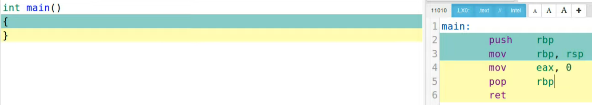
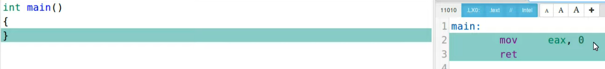
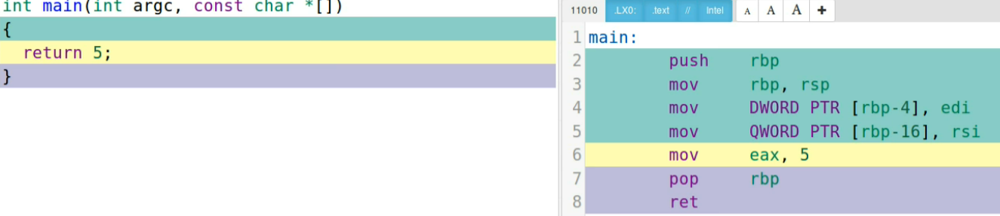
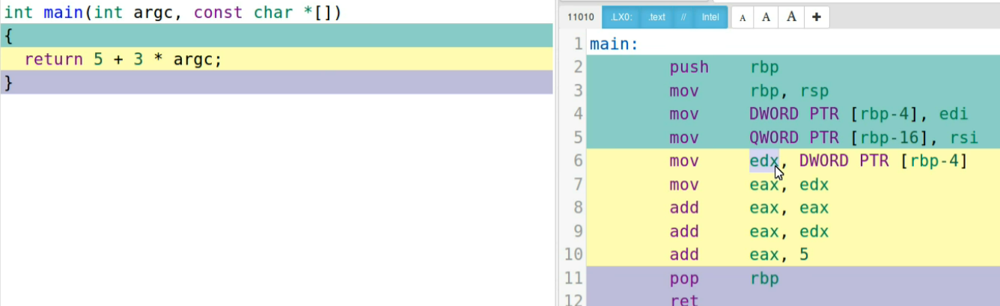
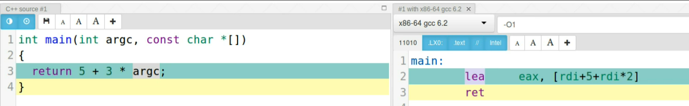
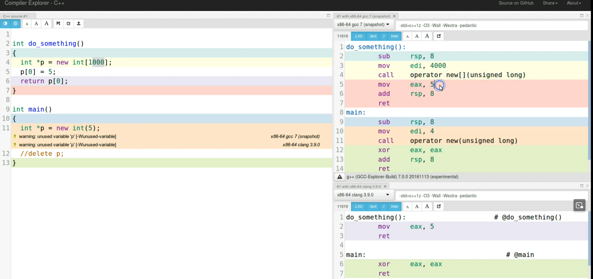

Week 4 4/22

OS: 
https://pages.cs.wisc.edu/~remzi/OSTEP/
Ch 8-11 (one chapter is a summary)

C++ Weekly 31-45 
## Lambdas for free
```c++
struct Lambda {
    auto operator()() const {
        return 5;
    }
}
```
this code is the same thing as 
```c++ 
int main() {
    return []{ return 5; }();
}
```
Lambdas generate some assembly code, however after enabling optimizations or the flag `-Og` the cost of using lambdas is minimized extremely.

## Reading assembly
source is on the right and dest is on the left
different level of optimizations will result in different code being compiled thus different assembly instructions being generated.


no optimizations
this essentially pushes `rbp` onto a stack, moves rsp into rbp, moves 0 into eax and pops rbp for return

optimizations

an example int main() function with assembly code. Even though int main doesn't do anything, the compiler still has to do some stack management for the function main. 


`DWORD PTR[rbp-4], edi` is taking edi and moving it to some pointer on the stack


this code it can be observed that the add instruction is being repeated over and over again to preform the multiplication 

this is optimized assembly were `lea` is used to do the math by doing an index memory aalocation but wihout allocating the memory and just storing the result somewhere.

```c++
int main() {
    int i = 1;
    auto l = [i]() mutable { return ++i; };
    return l();
}
```
if we dont capture the state by reference we need to include mutable and the paran

```c++
int main() {
    int i = 1;
    auto l = [&i]{ return ++i; };
    return l();
}
```
an example of stateful lambda captured by reference
```c++
int main() {
    int i = 1;
    auto l = [i]() mutable { return ++i; };
    l();
    return i;
}
``` 
returns -> 1
in this example, since we make a copy of i invoking the lambda and returning i wont see a change. 
```c++
int main() {
    auto l = [i=0]() mutable {return ++i;};
    l();
    l();
    return l();
}
```
invoking lambda would actually increment i since the lambda returns i and we instantiate i in the lambda

## Class arguement type deduction
```c++
#include <tuple>
int main() {
    std::tuple t1(1,2); // same as std::tuple<int,int> t1(1,2)
    std::tuple t2(()[]{}, ()[]{});

    return t1 == t2
}
```
c++ class arguements can preform type deduction to assume the type of the class being made. In this example 2 tuples are being made of type ints and type lambdas.

## Inherting from Lambdas
using a struct it is possible to combine two or more lambdas that behave differently. 
```c++
#include <functional>
#include <type_traits>

template<typename L1, typename l2>
struct S : L1, L2 {
    S(L1 l1, L2 l2) : L1(std::move(l1)), L2(std::move(l2)) {}
    using L1::operator();
    using L2::operator();
}

int main() {
    auto l = []() {return 4};
    auto l2 = [](int i) {return i * 10};
    auto combined = S(l, l2);
    return combined(10);
}
```

## Constexpr Lambda
``` c++
int main() {
    constexpr auto cube = [](int x) {return x * x * x};
}

```
## Clang Heap Elision
```c++
int main () {
    int *p = new int(5);
}
```
In this example some memory is being allocated for the int p, however with the heap elisions the code gets compiled down. 

In this example the main function is generating a lot more code vs clang that identifies the allocation and eventual deallocation. This technique improves overhead for common programming patterns like creating an object that eventually gets deleted. 