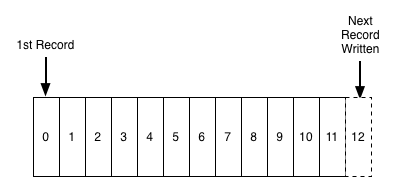
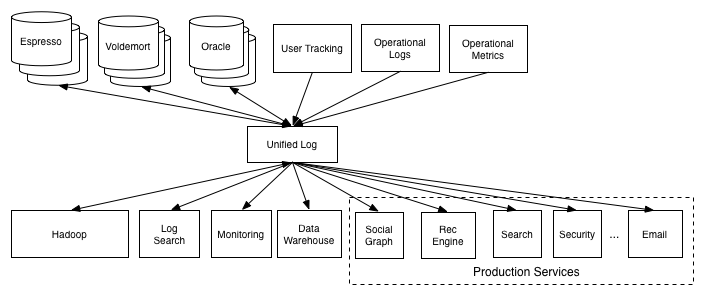

https://engineering.linkedin.com/distributed-systems/log-what-every-software-engineer-should-know-about-real-time-datas-unifying

logs are append-only simplest form of data storage abstraction. They are ordered by time. Items are appended left to right and each entry is given a unique log id.

Logs were introduced to databases as a source of truth for prevention against crashes. They keep track of what happened and when.

Logs are also used for replication, as they can be used to keep replica databases in sync.

In distributed systems logs are also used for consensus algorithims and to reproduce deteriministic behavior. It is also used for disitrbuted computing, multiple machines are fed a consistent log as input this way the seperate machines can process large inputs. 

The use case varies depending on what is put in the log. Another unique use case is inserting machine instructions or processes to run. Since in a distributed system they will all run in the same order, the output will always be the same. 

- In primary backup, the log is a way to keep the replicas in sync with the master
- In state machine replication, the writes are FIRST written to the log, and then executed across the replicas. 

## Data 
2 things cause data integration problems
- the expolsion of specialized data systems
- the rise of event data

specifically at LinkedIn, there was a problem of setting up data pipelines properly as other sources would benefit from them. Eventually an approach was chosen to use a unified log to talk to other services
