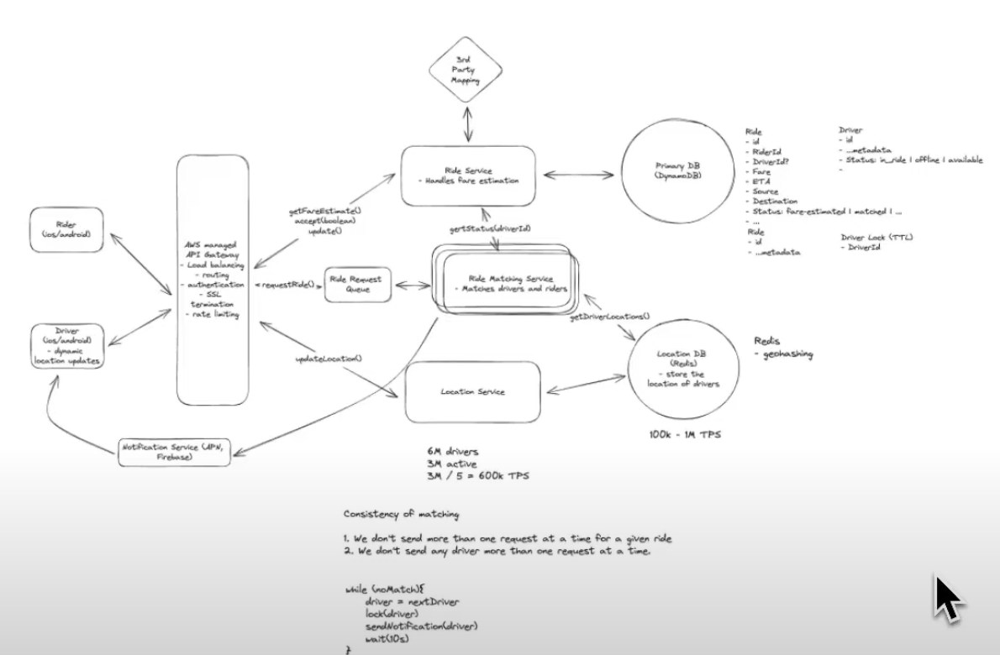

## Design Uber
https://www.youtube.com/watch?v=lsKU38RKQSo

main takeways
- format interviews in this structure
  - define functional requirements
  - define non functional requirements
  - define APIs based on functional requirements
  - design high level overview
  - dig deeper based off non functional requirements
- Geospatial data in this system is a tough thing to consider. Postgresql has something called a quad tree, that is a tree that can store geospatial data effectively however in this system the drivers are pinging the servers very n seconds meaning that the database has to undergo constant reblancing. The more optimal approach is Redis geohashing which does not have to undergo that complex reblance and just rehasing. It is also faster since it is in memory and since it is geodata the need for peristency is not that heavy.
- For services that are communicating and can potentially request the same item and we dont want that behavior a redis distributed lock is an appropriate solution. 
- Assuming we randomly get hit with thousands of users at once, spinning up new instances is too slow. A rider queue can be used to handle a ton of incoming traffic to avoid slamming the services. The queue can be partitioned based on location. 

The main idea in this system is to have a ride service that handles fare estimations, another service that actually matches a rider to a driver, and a location service that pings the Redis store. When a user gets an estimate, the estimation service preforms some ... logic to provide a potential rider. 

The driver then recieves a request from the ridee. If they accept, a ride object is created in the database. This item includes information like where the rider is going, etc. 

